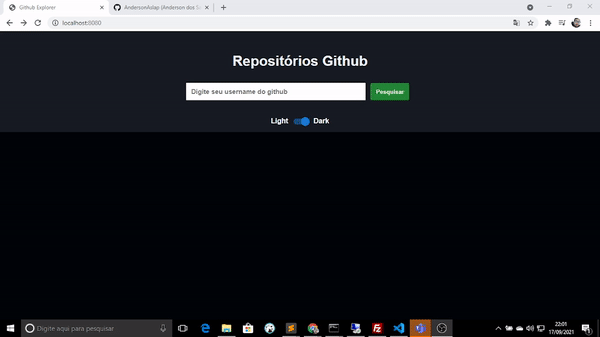

<h1>Git Explorer</h1>

 

> Sobre o Git Explorer

O Git Explorer é um projeto no qual trás uma facilidade ao usuário
realizar a vizualização de seus repositórios, o usuário apenas informa seu username
e a plataforma encarrega de fazer a comunicação com a API do github e trazer os repositórios do usuário.

 

> Tecnologias Ultilizadas

<ul>
  <li>React</li>
  <li>Typescript</li>
  <li>Javascript</li>
  <li>Html</li>
  <li>CSS3</li>
</ul>

 
  
  
  
  
  

